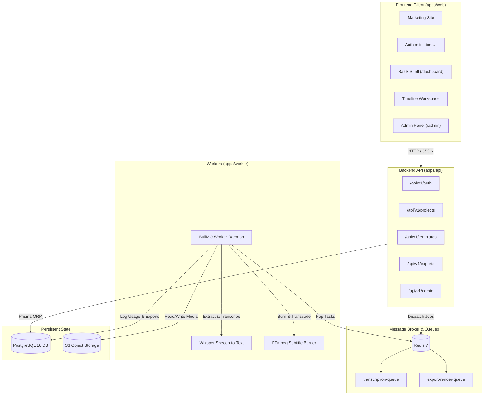

# CaptionStudio PRO — SaaS Platform (Phase 1 & Phase 2)

> **CaptionStudio PRO** is a commercial-grade, web-based video caption and subtitle creation SaaS platform designed for high-growth video creators, podcasters, and media production agencies.

---

## Architecture Overview

CaptionStudio PRO is organized as a high-performance TypeScript monorepo powered by **Turborepo** and **pnpm workspaces**.



---

## Monorepo Folder Structure

```
CaptionStudio PRO/
├── apps/
│   ├── web/                     # Next.js 14 App Router (Marketing, Auth, Dashboard, Admin)
│   ├── api/                     # Modular Node.js / Express REST API (/api/v1)
│   └── worker/                  # BullMQ background processing worker daemon
│
├── packages/
│   ├── ui/                      # Shared design tokens & Radix UI primitives
│   ├── database/                # Prisma ORM schema, client singleton, seed scripts
│   ├── auth/                    # Scrypt password hashing, session guards, RBAC
│   ├── captions/                # Parsers (SRT, VTT, ASS), tokenizers, groupers, serializers
│   ├── media/                   # FFmpeg abstractions, probe, audio extraction, transcoding
│   ├── storage/                 # StorageProvider abstraction (Local FS & S3-compatible)
│   ├── billing/                 # Plan definitions, quotas, usage ledger math
│   ├── queue/                   # BullMQ queue definitions and job contracts
│   ├── config/                  # Shared base tsconfig and tailwind configurations
│   └── types/                   # Shared domain interfaces, DTOs, Zod schemas
│
├── infrastructure/
│   └── docker/                  # Service Dockerfiles
│
├── docs/                        # Complete technical and architectural documentation
│   ├── architecture.md
│   ├── database.md
│   ├── authentication.md
│   ├── storage.md
│   ├── api.md
│   ├── jobs.md
│   ├── captions.md
│   ├── deployment.md
│   └── security.md
│
├── tests/                       # Monorepo test suites
│   ├── captions.test.ts
│   ├── billing.test.ts
│   ├── rbac.test.ts
│   └── auth.test.ts
│
├── docker-compose.yml           # Local PostgreSQL, Redis, MinIO infrastructure
├── package.json                 # Monorepo root package.json
├── pnpm-workspace.yaml          # Workspaces definition
├── turbo.json                   # Turborepo task pipeline
├── .env.example                 # Environment variable template
└── README.md                    # Root project documentation
```

---

## Technology Stack

- **Frontend**: Next.js 14, React 18, TypeScript, Tailwind CSS, Lucide Icons, React Hook Form, Zod, Zustand, TanStack Query, NextThemes.
- **Backend & API**: Node.js, Express, TypeScript, Zod validation, RFC 7807 problem details.
- **Database & State**: PostgreSQL 16, Prisma ORM, Redis 7 (BullMQ broker).
- **Media & Processing**: FFmpeg command abstraction, Whisper AI 16kHz mono audio pipeline, ASS/SSA subtitle engine.
- **Storage**: Unified `IStorageProvider` interface supporting local filesystem and S3/MinIO/Cloudflare R2.
- **Security**: Scrypt password hashing, timing-safe equality, RBAC, input sanitization, HTTP-only secure session cookies.

---

## Local Development Setup

### 1. Prerequisites
- **Node.js**: v18.0.0 or later (v20+ recommended)
- **pnpm**: v9.0.0 or later
- **Docker**: For PostgreSQL, Redis, and MinIO (optional if using external instances)

### 2. Install Dependencies
```bash
pnpm install
```

### 3. Environment Configuration
Copy `.env.example` to `.env`:
```bash
cp .env.example .env
```

### 4. Start Local Infrastructure (Docker)
```bash
docker-compose up -d
```
This launches:
- **PostgreSQL**: `localhost:5432`
- **Redis**: `localhost:6379`
- **MinIO S3**: `localhost:9000` (Console at `localhost:9001`)

### 5. Database Migration & Realistic Seeding
```bash
pnpm db:push
pnpm db:seed
```
Seeds realistic plans (Free, Creator, Pro, Business), 50+ templates, demo user `alex.creator@captionstudio.io`, workspace, and sample projects.

### 6. Run All Monorepo Services
```bash
pnpm dev
```
- **Web Application**: [http://localhost:3000](http://localhost:3000)
- **API Server**: [http://localhost:4000](http://localhost:4000)
- **Background Worker**: Running BullMQ queue listeners

---

## Testing & Quality Assurance

Run the test suite across caption parsing, billing quotas, RBAC authorization, and password cryptography:
```bash
pnpm test
```

Run TypeScript compilation check across all packages and applications:
```bash
pnpm typecheck
```

---

## Platform Engineering Roadmap (Phases 1 – 9)

- [x] **Phase 1: Foundation & SaaS Shell**: Design system, Next.js 14 layout, Prisma schema, Turborepo architecture.
- [x] **Phase 2: Production Backend, Auth, Projects & Uploads**: PostgreSQL DB integration, scrypt auth & session cookies, workspace RBAC, project CRUD, S3/local storage abstraction, BullMQ media analysis worker (`captionstudio-media-analysis`), subtitle parser (SRT/VTT/ASS), SSE real-time updates.
- [ ] **Phase 3: AI Speech-to-Text Engine**: Self-hosted Whisper STT worker container, word-level alignment, speaker diarization, audio denoiser.
- [ ] **Phase 4: Timeline & Caption Editor**: Full multi-track video timeline editor, split/merge hotkeys, waveform visualizer.
- [ ] **Phase 5: Caption Design & Kinetic Typography**: Advanced kinetic typography rendering engine with bezier spring curves and particle highlights.
- [ ] **Phase 6: High-Performance Video Rendering Engine**: High-throughput GPU FFmpeg subtitle burning cluster (4K 60 FPS, ProRes, WebM, MP4).
- [ ] **Phase 7: Production Stripe Billing**: Subscriptions, usage meter webhooks, and Stripe Customer Portal.
- [ ] **Phase 8: Super Admin & Team Collaboration**: Cluster monitoring, user impersonation, and team seat management.
- [ ] **Phase 9: Production Hardening, Edge CDN & Observability**: Global CDN edge distribution, Prometheus/Grafana observability, and SOC2 audit compliance.

