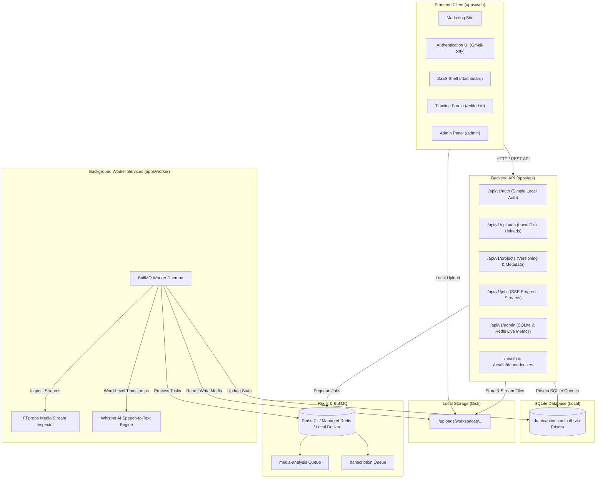

# CaptionStudio PRO — Local Development Architecture (SQLite + Local Storage)

> **CaptionStudio PRO** is a commercial-grade, web-based video caption and subtitle creation SaaS platform designed for video creators, podcasters, and media production agencies.

---

## Local Development Architecture

CaptionStudio PRO is configured for rapid, dependency-light local development:
- **Database**: Local SQLite via Prisma (`data/captionstudio.db`) with automatic absolute path resolution across all monorepo packages.
- **Storage**: Local filesystem storage (`./uploads`) with direct HTTP streaming.
- **Authentication**: Simple Local Authentication (`@gmail.com` addresses only, password $\ge 8$ chars, immediate session cookie generation, no email verification, no OAuth, no Redis rate limiter on auth).
- **Background Processing**: Redis + BullMQ for asynchronous media analysis and Whisper speech-to-text.
- **Media Engine**: Native FFmpeg & FFprobe alongside Whisper speech-to-text.



---

## Quickstart Guide

### 1. Prerequisites
- **Node.js**: `v20.x` or later
- **pnpm**: `v9.x` or `v11.x`
- **FFmpeg & FFprobe**: Installed and available in PATH (or set `FFMPEG_PATH` in `.env`)
- **Redis**: Local Redis instance (`docker compose up -d redis` or managed cloud Redis)

### 2. Install Dependencies
```bash
pnpm install
```

### 3. Setup SQLite Database
```bash
# Push schema to SQLite (creates data/captionstudio.db)
pnpm db:push

# Seed default admin, user accounts, and templates
pnpm db:seed
```

Default seeded credentials:
- **Admin**: `admin@gmail.com` / `admin123456`
- **User**: `user@gmail.com` / `user123456`

### 4. Start Development Servers
```bash
pnpm dev
```
- **Web App**: [http://localhost:3000](http://localhost:3000)
- **API Server**: [http://localhost:4000](http://localhost:4000)
- **Health Check**: [http://localhost:4000/health](http://localhost:4000/health)

---

## Monorepo Workspace Structure

```
CaptionStudio PRO/
├── apps/
│   ├── web/                     # Next.js 14 App Router (Marketing, Auth, Studio Editor, Dashboard, Admin)
│   ├── api/                     # Express REST API (/api/v1, /health, /health/dependencies)
│   └── worker/                  # BullMQ background processing worker daemon (FFprobe & Whisper STT)
│
├── packages/
│   ├── database/                # Prisma ORM schema (SQLite), migrations, system seed script
│   ├── storage/                 # StorageProvider abstraction (LocalStorageProvider & S3Provider)
│   ├── queue/                   # Redis connection, BullMQ queue definitions, job contracts
│   ├── captions/                # Defensive parsers (SRT, WebVTT, ASS), timing tokenizers, serializers
│   ├── media/                   # FFmpeg abstractions, media probe, audio extraction
│   ├── auth/                    # Scrypt password hashing, session tokens, RBAC permissions
│   ├── billing/                 # Local development usage tracking, plan quotas, ledger math
│   ├── ui/                      # Shared design tokens & Radix UI primitives
│   ├── config/                  # Shared tsconfig and tailwind configurations
│   └── types/                   # Unified TypeScript schemas, DTOs, and domain models
│
├── data/                        # SQLite database storage (captionstudio.db)
└── uploads/                     # Local filesystem media storage
```
