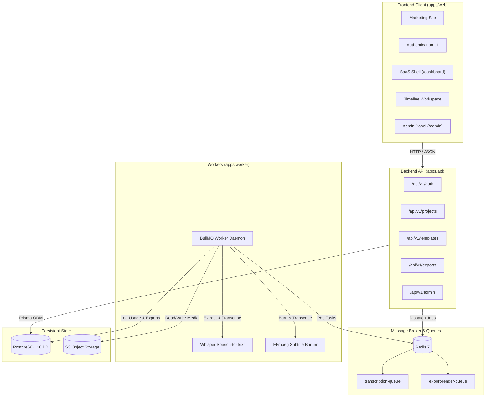

# CaptionStudio PRO — SaaS Platform (Phase 1 & Phase 2)

> **CaptionStudio PRO** is a commercial-grade, web-based video caption and subtitle creation SaaS platform designed for high-growth video creators, podcasters, and media production agencies.

---

## Architecture Overview

CaptionStudio PRO is organized as a high-performance TypeScript monorepo powered by **Turborepo** and **pnpm workspaces**.



---

## Monorepo Folder Structure

```
CaptionStudio PRO/
├── apps/
│   ├── web/                     # Next.js 14 App Router (Marketing, Auth, Dashboard, Admin)
│   ├── api/                     # Modular Node.js / Express REST API (/api/v1)
│   └── worker/                  # BullMQ background processing worker daemon
│
├── packages/
│   ├── ui/                      # Shared design tokens & Radix UI primitives
│   ├── database/                # Prisma ORM schema, client singleton, seed scripts
│   ├── auth/                    # Scrypt password hashing, session guards, RBAC
│   ├── captions/                # Parsers (SRT, VTT, ASS), tokenizers, groupers, serializers
│   ├── media/                   # FFmpeg abstractions, probe, audio extraction, transcoding
│   ├── storage/                 # StorageProvider abstraction (Local FS & S3-compatible)
│   ├── billing/                 # Plan definitions, quotas, usage ledger math
│   ├── queue/                   # BullMQ queue definitions and job contracts
│   ├── config/                  # Shared base tsconfig and tailwind configurations
│   └── types/                   # Shared domain interfaces, DTOs, Zod schemas
│
├── infrastructure/
│   └── docker/                  # Service Dockerfiles
│
├── docs/                        # Complete technical and architectural documentation
│   ├── architecture.md
│   ├── database.md
│   ├── authentication.md
│   ├── storage.md
│   ├── api.md
│   ├── jobs.md
│   ├── captions.md
│   ├── deployment.md
│   └── security.md
│
├── tests/                       # Monorepo test suites
│   ├── captions.test.ts
│   ├── billing.test.ts
│   ├── rbac.test.ts
│   └── auth.test.ts
│
├── docker-compose.yml           # Local PostgreSQL, Redis, MinIO infrastructure
├── package.json                 # Monorepo root package.json
├── pnpm-workspace.yaml          # Workspaces definition
├── turbo.json                   # Turborepo task pipeline
├── .env.example                 # Environment variable template
└── README.md                    # Root project documentation
```

---

## Technology Stack

- **Frontend**: Next.js 14, React 18, TypeScript, Tailwind CSS, Lucide Icons, React Hook Form, Zod, Zustand, TanStack Query, NextThemes.
- **Backend & API**: Node.js, Express, TypeScript, Zod validation, RFC 7807 problem details.
- **Database & State**: PostgreSQL 16, Prisma ORM, Redis 7 (BullMQ broker).
- **Media & Processing**: FFmpeg command abstraction, Whisper AI 16kHz mono audio pipeline, ASS/SSA subtitle engine.
- **Storage**: Unified `IStorageProvider` interface supporting local filesystem and S3/MinIO/Cloudflare R2.
- **Security**: Scrypt password hashing, timing-safe equality, RBAC, input sanitization, HTTP-only secure session cookies.

---

## Local Development Setup

### 1. Prerequisites
- **Node.js**: v18.0.0 or later (v20+ recommended)
- **pnpm**: v9.0.0 or later
- **Docker**: For PostgreSQL, Redis, and MinIO (optional if using external instances)

### 2. Install Dependencies
```bash
pnpm install
```

### 3. Environment Configuration
Copy `.env.example` to `.env`:
```bash
cp .env.example .env
```

### 4. Start Local Infrastructure (Docker)
```bash
docker-compose up -d
```
This launches:
- **PostgreSQL**: `localhost:5432`
- **Redis**: `localhost:6379`
- **MinIO S3**: `localhost:9000` (Console at `localhost:9001`)

### 5. Database Migration & Realistic Seeding
```bash
pnpm db:push
pnpm db:seed
```
Seeds realistic plans (Free, Creator, Pro, Business), 50+ templates, demo user `alex.creator@captionstudio.io`, workspace, and sample projects.

### 6. Run All Monorepo Services
```bash
pnpm dev
```
- **Web Application**: [http://localhost:3000](http://localhost:3000)
- **API Server**: [http://localhost:4000](http://localhost:4000)
- **Background Worker**: Running BullMQ queue listeners

---

## Testing & Quality Assurance

Run the test suite across caption parsing, billing quotas, RBAC authorization, and password cryptography:
```bash
pnpm test
```

Run TypeScript compilation check across all packages and applications:
```bash
pnpm typecheck
```

---

---

## Phase 2 Status & Hardening Summary

### Implemented
- **Real PostgreSQL Database**: Production connection and 22 relational models managed with Prisma ORM.
- **Real Authentication & Sessions**: Native `crypto.scrypt` password hashing, timing-safe equality, 32-byte cryptographically secure session rotation.
- **HTTP-Only Cookies**: Protected `cs_session` cookies (`SameSite=Lax`, `Secure`, `HttpOnly`).
- **Workspace Isolation & RBAC**: Tenant isolation with `OWNER`, `ADMIN`, `EDITOR`, and `VIEWER` roles.
- **Project CRUD & IDOR Guard**: Project creation, listing, duplicate, archive, delete, and IDOR prevention middleware.
- **Upload Architecture**: Direct signed upload URLs, multi-tenant path isolation (`workspaces/{wId}/projects/{pId}/{type}/{fileId}.{ext}`).
- **Pluggable Storage Abstraction**: `LocalStorageProvider` (dev/self-hosted) and `S3StorageProvider` (AWS S3, MinIO, Cloudflare R2).
- **BullMQ Queue Infrastructure**: Redis-backed queues (`captionstudio-media-analysis`, `captionstudio-transcription`, `captionstudio-export`).
- **Server-Sent Events (SSE)**: Real-time progress updates on `/api/v1/jobs/:id/events` with connection teardown on terminal states.
- **Subtitle Parsing Engine**: Defensive parsers for SRT, WebVTT, and ASS formats with word-level interpolation.
- **Audit Logging**: Non-blocking asynchronous security and resource action logging.

### Hardened (Critical Production Fixes)
- **Real Password Reset**:
  - `PasswordResetToken` table with single-use enforcement, 30-minute expiration, and SHA-256 token hashing.
  - Zero raw token exposure in database.
  - Generic `/forgot-password` response prevents user enumeration.
  - Revokes all active user sessions upon successful password reset.
  - `EmailService` abstraction supporting console in development and configurable SMTP/API in production.
- **Zero Fake FFprobe Fallback**:
  - Removed all fabricated fallback metadata (`1920x1080 30fps 60s`).
  - Corrupted media or probe failure cleanly fails the job with `MEDIA_PROBE_FAILED` and user-friendly diagnostics.
  - True stream validation verifies video stream existence, positive width/height, and container duration.
- **Authorized Local Storage Downloads**:
  - `GET /api/v1/uploads/storage/:key` is strictly authenticated.
  - Database asset lookup ensures the requesting user belongs to the project's workspace.
  - Canonical path resolution blocks all directory traversal attempts (`..`).
- **Distributed Redis Rate Limiting**:
  - Replaced in-memory map with Redis-backed atomic increment rate limiting.
  - Configurable windows and thresholds for authentication and upload endpoints.
  - Graceful fallback protects against cascading failures.
- **Session Token Leakage Prevention**:
  - Removed raw `token` from `/signup` and `/login` JSON responses; browser auth relies purely on secure HTTP-only cookies.
- **Reliable Queue Dispatch**:
  - Upload completion safely traps queue dispatch errors, records `QUEUE_DISPATCH_FAILED`, and resets project status instead of leaving jobs silently stuck in `PENDING`.
- **Real Admin Metrics & Actions**:
  - Completely eradicated fake data (`mrrUsd = 14500`, `storageUsedBytes = 4200000000000`, `plan = PRO`, `projectsCount = 5`).
  - Queries actual database counts, real storage aggregates, real job status distributions, and marks billing metrics as `NOT_IMPLEMENTED`.
  - Admin status updates validated via Zod enum, prevents self-suspension, revokes sessions on suspension, and logs audit events.
- **Defensive Subtitle Resource Limits**:
  - Enforced 5MB max text limits, 10,000 maximum cues, and 2,000 character line length guards.

### Not Yet Implemented (Deferred to Future Phases)
- **Phase 3**: Whisper AI STT worker container, word-level alignment, speaker diarization, audio denoiser.
- **Phase 4**: Multi-track video timeline editor, split/merge hotkeys, waveform visualizer.
- **Phase 5**: Kinetic typography rendering engine with bezier spring curves and particle highlights.
- **Phase 6**: High-throughput GPU FFmpeg subtitle burning cluster (4K 60 FPS, ProRes, WebM, MP4).
- **Phase 7**: Production Stripe billing integration with webhooks and customer portal.
- **Phase 8**: Super Admin cluster monitoring, user impersonation, and team seat management.
- **Phase 9**: Global CDN edge distribution, observability (Prometheus/Grafana), and SOC2 audit compliance.


