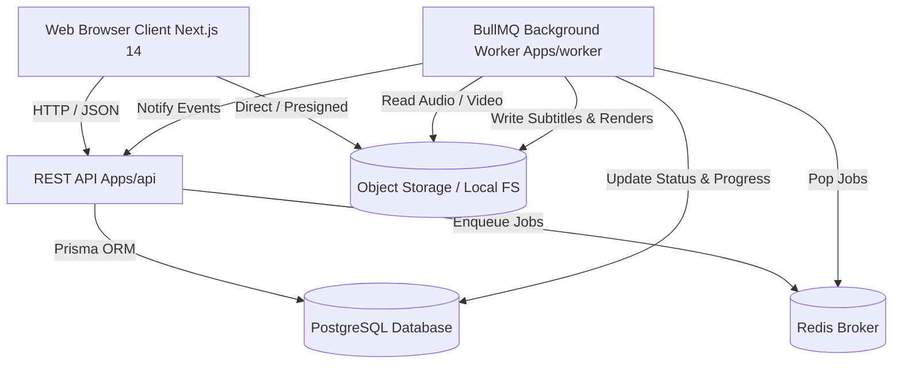

# CaptionStudio PRO — System Architecture

## Overview

CaptionStudio PRO is engineered with a modern, high-throughput, monorepo architecture separating web presentation, API ingestion, persistent storage, queuing, and GPU/CPU worker execution.

## Core Subsystems

### 1. Presentation & SaaS Application Shell (`apps/web`)
- **Next.js 14 App Router**: Server-rendered marketing pages, static documentation, and interactive client application shells.
- **Tailwind CSS & Token System**: Strict semantic tokens supporting light and custom dark (#09090B, #111113, #18181B) themes with `#635BFF` brand primary.
- **Client & Server State**: React Query for cache synchronization with API endpoints; Zustand for interactive editor and timeline scrubber state.

### 2. Versioned Modular API (`apps/api`)
- Express-based modular routing mounted at `/api/v1/`.
- Strict input validation via Zod schemas.
- RFC 7807 compliant error format preventing leakage of stack traces or Prisma internals.

### 3. Background Processing Daemon (`apps/worker`)
- Decoupled BullMQ worker pool executing async jobs:
  - `TRANSCRIPTION`: Audio extraction, speech-to-text, word-level alignment.
  - `MEDIA_ANALYSIS`: Video probing, duration, dimension, and codec validation.
  - `THUMBNAIL`: Extraction of web-optimized preview frames.
  - `RENDER / EXPORT`: FFmpeg subtitle burning and 1080p/4K MP4 transcode.

### 4. Domain Packages (`packages/*`)
- Pure separation of concerns:
  - `@captionstudio/database`: Prisma client singleton, schema, migrations, seed script.
  - `@captionstudio/captions`: Multi-format parsers (SRT, VTT, ASS), word tokenizers, line groupers, and serializers.
  - `@captionstudio/media`: Abstract FFmpeg command executor, audio extractor, and transcoder.
  - `@captionstudio/storage`: Abstract `StorageProvider` with local disk and S3-compatible providers.
  - `@captionstudio/queue`: BullMQ queue definitions, job contracts, Redis connection pool.
  - `@captionstudio/billing`: Plan configurations, quotas, and ledger calculations.
  - `@captionstudio/auth`: Scrypt password hashing, session tokens, and RBAC guards.
  - `@captionstudio/ui`: Reusable design system primitives.
  - `@captionstudio/types`: Shared TypeScript interfaces and DTOs.

---

## Phase 2 Implementation Architecture

### 1. Authentication & Session Security
- **Password Hashing**: Node.js native `crypto.scrypt` with random 16-byte salt, timing-safe buffer comparison (`crypto.timingSafeEqual`).
- **Session Tokens**: 32-byte cryptographically secure random hexadecimal tokens stored in `Session` table with 30-day TTL, rolling activity updates.
- **Cookies**: HTTP-only, `SameSite=Lax`, secure cookies (`cs_session`) with `cookie-parser` on the Express API.
- **OAuth Ready**: Domain schema supports linked `Account` records (provider + providerAccountId) for Google/GitHub OAuth login.
- **RBAC**: Multi-tenant authorization (`OWNER`, `ADMIN`, `MEMBER`, `VIEWER`) per workspace, preventing horizontal privilege escalation.

### 2. Workspace & Project Data Isolation
- Every project belongs to a `Workspace`. Every user belongs to one or more workspaces via `WorkspaceMember`.
- IDOR Prevention: `projectMiddleware` and `workspaceMiddleware` verify workspace tenancy before any project CRUD operations.
- Project duplication performs safe metadata cloning and links shared assets without duplicating multi-gigabyte video files.

### 3. Upload & Storage Architecture
- **Storage Abstraction**: `IStorageProvider` supports `LocalStorageProvider` (for local development and self-hosting) and `S3StorageProvider` (AWS S3, MinIO, Cloudflare R2).
- **Two-Step Upload Lifecycle**:
  1. `POST /api/v1/uploads/authorize`: Validates file type, size (<500MB), quota availability, and generates isolated storage key (`workspaces/{wId}/projects/{pId}/{type}/{fileId}.{ext}`).
  2. Direct client upload via signed upload URL or streaming storage endpoint.
  3. `POST /api/v1/uploads/complete`: Creates `Asset` record in DB and enqueues async processing jobs.

### 4. Asynchronous Media Analysis Worker
- **Queue**: `captionstudio-media-analysis` BullMQ queue backed by Redis with exponential backoff retries.
- **Media Probe**: Worker daemon calls `ffprobe` to extract real container metadata:
  - Video streams: dimensions (width/height), frame rate (FPS), video codec (`h264`, `hevc`, `vp9`, etc.), bitrate, duration.
  - Audio streams: audio codec (`aac`, `mp3`, `opus`), sample rate (Hz), channels, bitrate.
- **Progress Tracking**: Job progress updates persist to DB (`Job.progress`, `Job.status`) through 10% -> 30% -> 60% -> 85% -> 100%.

### 5. Real-Time Server-Sent Events (SSE)
- Endpoint: `GET /api/v1/jobs/:id/events`
- Client opens persistent SSE connection to listen for real job progress and terminal states (`COMPLETED`, `FAILED`).
- Prevents UI polling loops while ensuring immediate user feedback during media analysis and transcode operations.

### 6. Subtitle Parser Engine
- Multi-format ingestion support for:
  - **SRT**: SubRip timecode format (`00:01:23,456 --> 00:01:25,789`), HTML tag cleanup, word-level token interpolation.
  - **VTT**: WebVTT cues, note/header skipping, decimal timestamp parsing.
  - **ASS/SSA**: Advanced SubStation Alpha dialogue parsing, override tag stripping (`{\b1}`, `{\pos()}`, `\N`).

