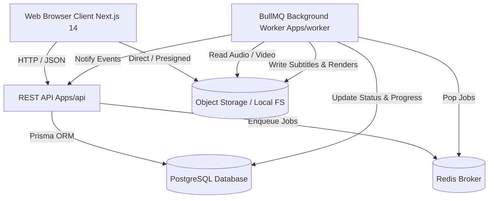

# CaptionStudio PRO — System Architecture

## Overview

CaptionStudio PRO is engineered with a modern, high-throughput, monorepo architecture separating web presentation, API ingestion, persistent storage, queuing, and GPU/CPU worker execution.

## Core Subsystems

### 1. Presentation & SaaS Application Shell (`apps/web`)
- **Next.js 14 App Router**: Server-rendered marketing pages, static documentation, and interactive client application shells.
- **Tailwind CSS & Token System**: Strict semantic tokens supporting light and custom dark (#09090B, #111113, #18181B) themes with `#635BFF` brand primary.
- **Client & Server State**: React Query for cache synchronization with API endpoints; Zustand for interactive editor and timeline scrubber state.

### 2. Versioned Modular API (`apps/api`)
- Express-based modular routing mounted at `/api/v1/`.
- Strict input validation via Zod schemas.
- RFC 7807 compliant error format preventing leakage of stack traces or Prisma internals.

### 3. Background Processing Daemon (`apps/worker`)
- Decoupled BullMQ worker pool executing async jobs:
  - `TRANSCRIPTION`: Audio extraction, speech-to-text, word-level alignment.
  - `MEDIA_ANALYSIS`: Video probing, duration, dimension, and codec validation.
  - `THUMBNAIL`: Extraction of web-optimized preview frames.
  - `RENDER / EXPORT`: FFmpeg subtitle burning and 1080p/4K MP4 transcode.

### 4. Domain Packages (`packages/*`)
- Pure separation of concerns:
  - `@captionstudio/database`: Prisma client singleton, schema, migrations, seed script.
  - `@captionstudio/captions`: Multi-format parsers (SRT, VTT, ASS), word tokenizers, line groupers, and serializers.
  - `@captionstudio/media`: Abstract FFmpeg command executor, audio extractor, and transcoder.
  - `@captionstudio/storage`: Abstract `StorageProvider` with local disk and S3-compatible providers.
  - `@captionstudio/queue`: BullMQ queue definitions, job contracts, Redis connection pool.
  - `@captionstudio/billing`: Plan configurations, quotas, and ledger calculations.
  - `@captionstudio/auth`: Scrypt password hashing, session tokens, and RBAC guards.
  - `@captionstudio/ui`: Reusable design system primitives.
  - `@captionstudio/types`: Shared TypeScript interfaces and DTOs.

