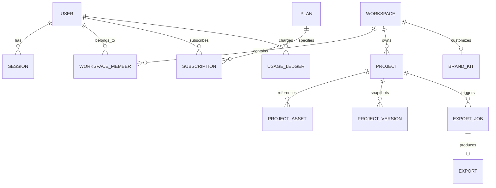

# CaptionStudio PRO — Database Architecture

## Overview

The database layer utilizes **PostgreSQL** orchestrated via **Prisma ORM**. The data model supports multi-tenant workspaces, granular role-based access control, subscription metering, and versioned subtitle tracks.

## Entity Relationship Overview

## Primary Models

1. **User & Identity**:
   - `User`: Core user record, password hash, status enum (`ACTIVE`, `SUSPENDED`), role (`USER`, `CREATOR`, `ADMIN`).
   - `Session`: Token-based active sessions with user-agent and IP audit metadata.
   - `OAuthAccount`: Linked Google and GitHub identity credentials.

2. **Workspaces & Collaboration**:
   - `Workspace`: Multi-tenant boundary isolating projects and team assets.
   - `WorkspaceMember`: Mapping users to workspaces with RBAC (`OWNER`, `ADMIN`, `EDITOR`, `VIEWER`).

3. **Billing & Subscriptions**:
   - `Plan`: Tiers (`FREE`, `CREATOR`, `PRO`, `BUSINESS`), pricing, minutes allocation, and feature flags.
   - `Subscription`: Active billing cycle interval, status (`ACTIVE`, `PAST_DUE`, `CANCELED`).
   - `Invoice` & `Payment`: Transaction receipts and amounts paid.
   - `UsageLedger`: Immutable ledger auditing consumption of transcription minutes, render minutes, and storage bytes.

4. **Projects & Media**:
   - `Project`: Project metadata, resolution, duration, active template reference.
   - `ProjectAsset`: Video/audio file metadata referencing storage keys.
   - `ProjectVersion`: Snapshots of full word timestamp arrays and styling configurations in JSON.

5. **Templates & Presets**:
   - `TemplateCategory`: Categorization (Trending, Minimal, Podcast, Gaming, Shorts, etc.).
   - `Template`: Reusable caption typography and animation presets.
   - `BrandKit`: Workspace brand colors, uploaded logo watermark, and default presets.

