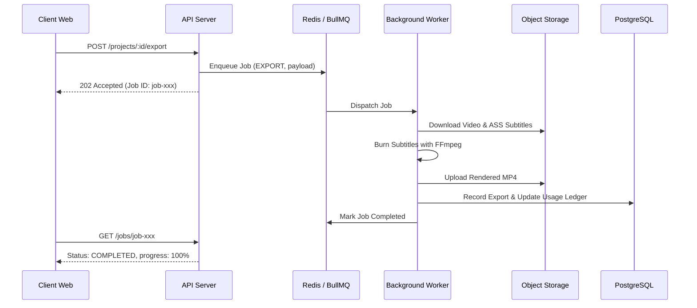

# Background Queue & Job Architecture

## Asynchronous Processing Workflow

Heavy video operations (audio extraction, neural transcription, subtitle burning) are never executed inside synchronous HTTP request handlers. Instead, the API server dispatches typed jobs to Redis-backed BullMQ queues:

## Queues
1. `captionstudio-transcription`: Audio extraction & speech-to-text processing.
2. `captionstudio-thumbnail`: Quick thumbnail extraction from video keyframes.
3. `captionstudio-export`: FFmpeg ASS burning and final MP4 encoding.

